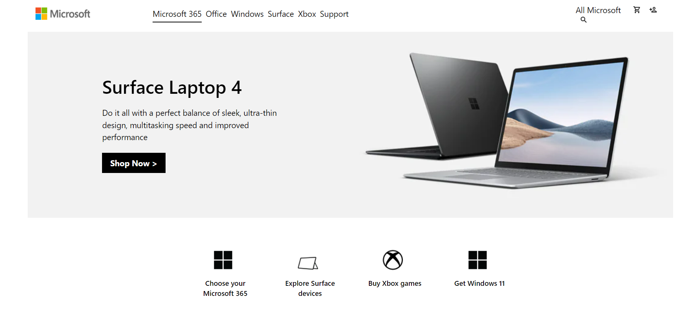
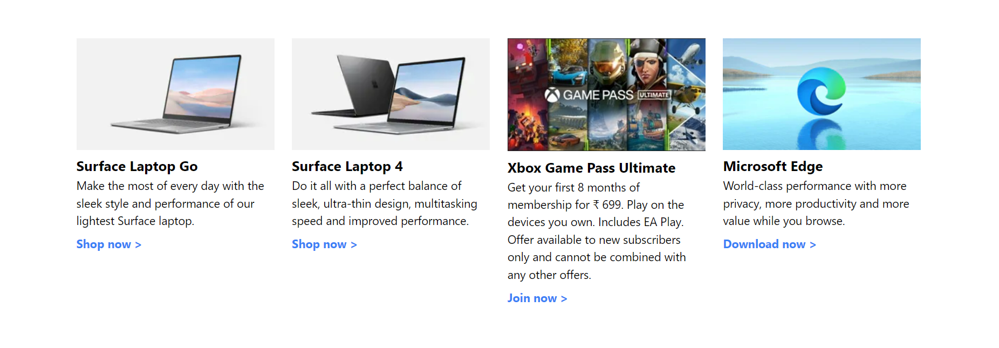
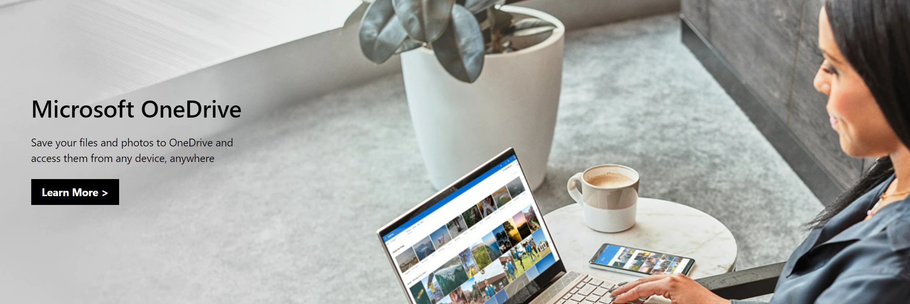
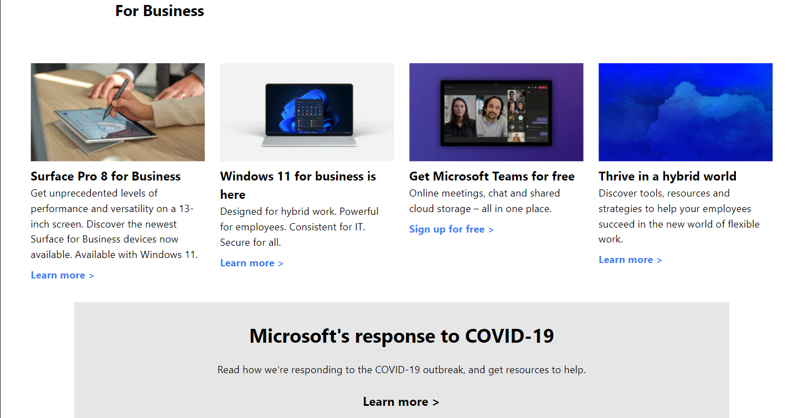
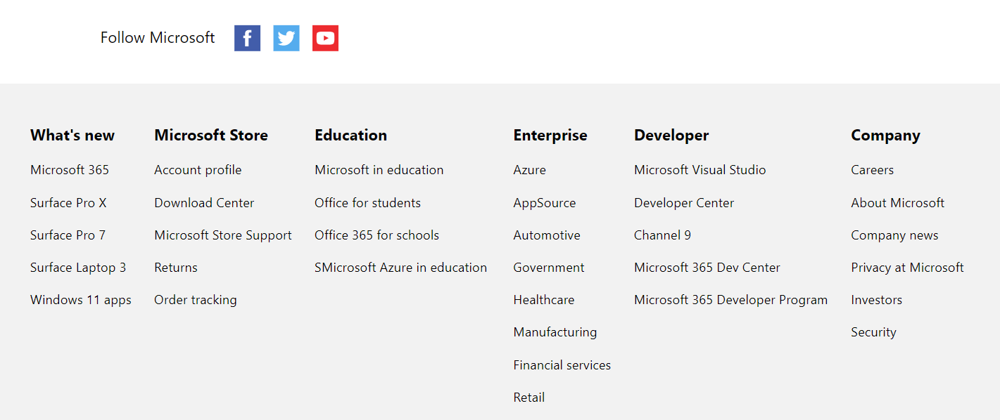

## Overview
It Consists of Home page of Microsoft.
 
### Home Page

#### This page is fully made up of Tailwind-css along with media-queries!

### Links

- Solution URL: (https://github.com/Sonu-Dutta/Facebook-Clone)
- Live Site URL: (https://facebook-clone-flax.vercel.app/)

## My process

### Built with

- Visual Studio
- Semantic HTML5 markup
- CSS custom properties
- Flexbox
- TailwindCss 
- Mobile-first workflow
- [React](https://reactjs.org/) - JS library
- [Next.js](https://nextjs.org/) - React framework

## Author

- Linkedin - [Sonu-Dutta](https://www.linkedin.com/in/sonu-dutta-6900b3218)
- Twitter - [@sonudutta9999](https://mobile.twitter.com/sonudutta9999)
- Email-(itsmesonudutta@gmail.com)

